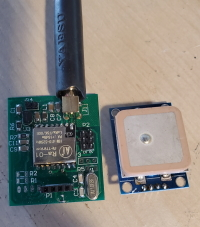

# DigiPro
 Lora APRS digipeater for AVR328
 
  

[See schematic and PCB](Board.pdf)

VA2AIG-4, Digipeater wide coverage (Have a bug with V2.0) [Map](https://fr.aprs.fi/#!call=a%2FVA2AIG-4&timerange=3600&tail=3600)

VE2YAG-4, Test digipeater, V2.1. Testing now at home, see telemetry.
[Telemetry](https://fr.aprs.fi/telemetry/a/VE2YAG-4) or see on [Map](https://fr.aprs.fi/info/a/VE2YAG-4)

I use also [MicroBeacon_2021](https://github.com/ve2yag/MicroBeacon_2021) as small testing tracker(same PCB) and Lorakiss as Kiss-over-IP Lora modem, hooked to APRX on a raspberry pi to create a dual-port igate with Direwolf.

